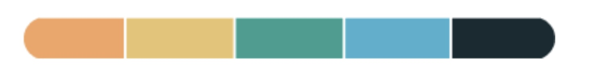

<h1 id="diversity-and-inclusion-portal">DIVERSITY & INCLUSION PORTAL</h1> 

## INTRODUCTION 
This project is the initial assessed output that forms an element of the Code Institute Full Stack Software Developer Bootcamp and aims to demonstrate use of the technologies and methodologies set out during the delivery of the course to date. 

The portal is located at the following URL: <a href="https://lancesissing.github.io/diversity-inclusion/" target="_blank">Diversity & Inclusion Portal</a>

<h2 align="left" id="TOC">CONTENTS</h2>

* [D&I PORTAL](#)
  - [Introduction](#introduction)
  - [About](#about)
* [PLANNING](#)
    - [UX DESIGN](#ux-design)
      - [User Stories](#user-stories)
      - [Colors](#colors)
      - [Fonts](#fonts)
      - [Images](#images)
      - [Wireframes](#wireframes)
* [FEATURES](#features)
  - [GENERAL](#general)
    - [Navigation](#navigation)
    - [Hero Section](#hero-section)
    - [Footer](#footer)
    - [Responsive Design](#responsive-design)
* [Credits](#credits)
  - [Bootstrap](#bootstrap)
  - [Content](#content-sources)
    

<a href="#diversity-and-inclusion-portal">Back To Top</a>

## ABOUT
The Diversity & Inclusion Portal is a conceptual design for an online resource that could be created to provide indivduals and organisations described in the User Stories to obtain information:
 
a) about Diversity & Inclusion and what it means; and
 
b) how to introduce Diversity & Inclusion into an environment such as a place of work.

### OBJECTIVES
- A one-stop resource setting out information about the subject matter utilising effective navigation and layout
- Responsive design consistent with web standards and accessibility requirements
- Inclusion of user-initiated actions to allow focus on specific topics
- Appropriate use of color and imagery ensuring 
- Clear presentation of content 

## UX DESIGN 
### USER STORIES 

**External User’s Goal:**  
Users seek an understanding of Diversity & Inclusion in the workplace or general understanding of related concepts 

**Site Owner’s Goal:**   
A visually appealing, easy-to-navigate page setting out Diversity & Inclusion information  and basic guidance on its implementation 

**User Story 1** 
As an HR professional I want information about D&I so I can implement it in my organisation

**User Story 2** 
As a member of management I want information about the benefits of implementing a D&I culture in my organisation 

**User Story 3** 
As an individual I want information about how D&I may be implemented in my workplace so I know what to expect 

**User Story 4** 
As a journalist I want to understand multiple perspectives of D&I and the challenges associated with its implementation 

<a href="#diversity-and-inclusion-portal">Back To Top</a>

### COLORS
Color selection was accompished using online resources such as pallette generators and AI. 
Compliance with related standards such as contrast and readability was ensured using [WebAIM](https://webaim.org/resources/contrastchecker/)

### Palette

- #F29957 - Orange  
- #E6BB64 - Sand  
- #249848 - Green  
- #3AA9C7 - Teal  
- #152B31 - Charcoal  

<a href="#diversity-and-inclusion-portal">Back To Top</a>

### FONTS
Font selection was based on the function of the site and its relatively formal purpose. Two sans-serif fonts were selected for the project, and implemented via [Google Fonts](https://fonts.google.com) using a direct import code within the style.css file

The fonts selected were:

<strong>Oswald</strong> 
to provide emphatic titling

<strong>Roboto</strong> 
to provide complimentary sub-text appearance

<a href="#diversity-and-inclusion-portal">Back To Top</a>

### WIREFRAMES
Wireframes illustrating the initial concepts for the portal were developed using a simple graphical programme and later updateD using elements of screenshots to more accurately represent the final outcome 

**MOBILE**

**TABLET**

**DESKTOP**

<a href="#diversity-and-inclusion-portal">Back To Top</a>

## IMAGES
Although a relatively formal site, the use of images illustrating themes of the site was considered appropriate
  
The images used were created for this project using the AI generator at http://freepik.com - a subscription based service 

<a href="#diversity-and-inclusion-portal">Back To Top</a>

## FEATURES

### GENERAL

The specific criteria set out in the LMS for this project were satisfied by the inclusion of each of the suggested features specified

#### NAVIGATION 
A Bootstrap 5.3 navigation bar was selected to create consistency with common user expectation and to allow for expansion of the portal beyond a single page in the future 

#### HERO SECTION
A Boootstrap 5.3 component 'Jumbotron' was implemented to provide the initial view of the portal with impact. This approach makes the purpose and content of the portal immediately clear to the visitor  

#### BOOTSTRAP GROUP LIST
A Boostrap Group List was used to create a sub-menu in the body of the page within the 'Benefits of D&I' section. This enables users to select from related subtopics using the related links

#### BOOTSTRAP CARDS
Boostrap cards were used to set out informaton relating to the challenges inherent in implenting a Diversity & Inclusion environment. The format of the cards allowed the addition of some further imagery to add interest to the page
  

#### FOOTER
A footer that is consistent with user expectations was implemented 

#### RESPONSIVE DESIGN
Utilising the Bootstrap Framework provided a method to develop a page that remains is responsive across the usual range of devices form mobile plratforms to high resolution computer screens

The utility at 'Am I Responsive' - https://ui.dev/amiresponsive was used to test responsiveness along with repeated use of the developer tools provided by web browsers

<a href="#diversity-and-inclusion-portal">Back To Top</a>

## CREDITS

### BOOTSTRAP
- [Bootstrap Docs](https://getbootstrap.com/docs/5.3)

### CONTENT SOURCES
Data regarding contemporary views of Diversity & Inclusion and its role in the modern workplace was compiled form a range of online resources 

<a href="#diversity-and-inclusion-portal">Back To Top</a>

